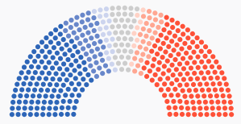

# module-parliament-chart

A parliament-style seat chart, useful for showing congressional membership.

[Demo.](https://the-politico.github.io/module_parliament-chart/)

A [reusable chart](https://github.com/The-Politico/generator-politico-graphics) module made with ❤️ at POLITICO.



### Install
```bash
$ yarn add git+ssh://git@github.com:The-Politico/module_parliament-chart
```

### Use

##### As a module

To use as a module, simply import the chart object:
```javascript
import ParliamentChart from 'module-parliament-chart';
```


The chart object has three methods, one to create the chart, initially, another to update chart elements with new data, and one to resize the chart.

```javascript
const myChart = new ParliamentChart();

// Data is an array of objects, one per party with a property that
// indicates the number of seats.
const data = [
  {
    party: 'dem',
    seats: 194,
  },
  {
    party: 'gop',
    seats: 241,
  },
];

// The create method needs a selection string, which will be parent
// to the chart elements, and a data array. You can also provide an
// optional properties object. Defaults shown

const props = {
  radiusCoef: 0.4,
  margin: {
    top: 10,
    right: 5,
    bottom: 10,
    left: 5,
  },
  seatsAccessor: d => d.seats,
  attrs: (d) => ({
    class: d.data.party,
  }),
  styles: (d) => ({
    fill: defaultColorScale(d.data.party),
  }),
};

myChart.create('#chart', data, props);

// The update method takes new data to update chart elements.
myChart.update(newData, newProps);

// The resize method can be called at any point to update the chart's size.
myChart.resize();
```

To apply this chart's default styles when using SCSS, simply define the variable `$ParliamentChart-container` to represent the ID or class of the chart's container(s) and import the `_chart.scss` partial.

```CSS
$ParliamentChart-container: '#chart';

@import '~module-parliament-chart/src/scss/chart';
```

##### In the browser

Include any dependencies, your stylesheet and the minified bundle, which defines a global chart object, `ParliamentChart`.

```html
<!-- head -->
<script src="https://cdn.jsdelivr.net/npm/babel-polyfill@6.26.0/dist/polyfill.min.js"></script>
<script src="https://d3js.org/d3.v5.min.js"></script>
<script src="chart.min.js"></script>
<link rel="stylesheet" type="text/css" href="styles.css">

<!-- body -->
<div id="ParliamentChart-container"></div>

<script type="text/javascript">
var myChart = new ParliamentChart();

myChart.create('#ParliamentChart-container', data);
</script>
```

### Developing the chart

Start developing:
```bash
$ yarn start
```

Build for production:
```bash
$ yarn build
```

Read [DEVELOPING](DEVELOPING.md) for more information on using this chart module pattern.
